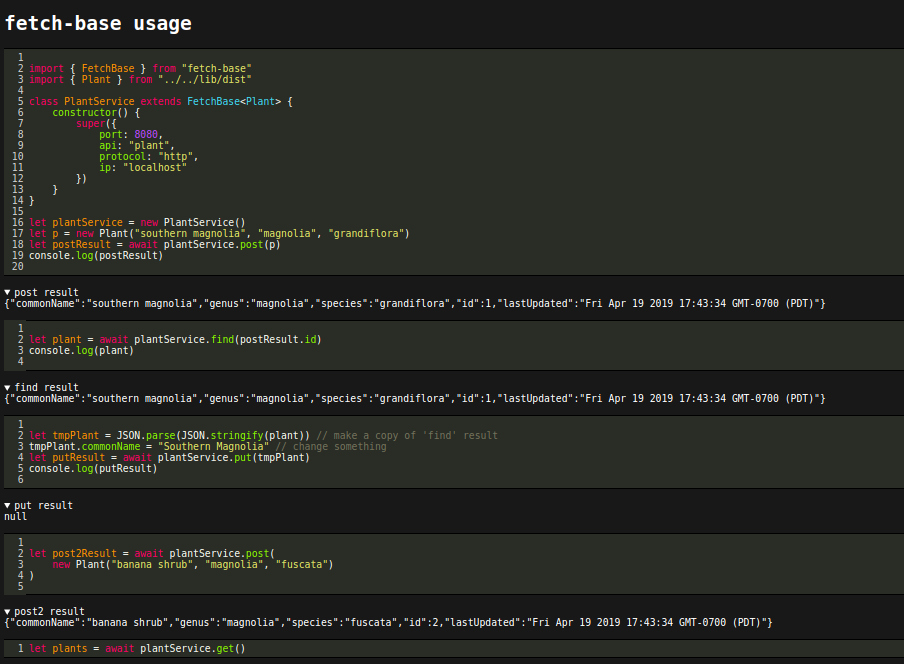

# fetch-base-test
example of using fetch-base npm package to consume json

https://www.npmjs.com/package/fetch-base

# install dependencies
```bash
npm install
```

# test the fetch-base npm package
```bash
# test runs clean & build scripts first
npm run test # run the "browser client" usage of fetch-base

npm run test-node # run the "nodejs client" usage of fetch-base
```


